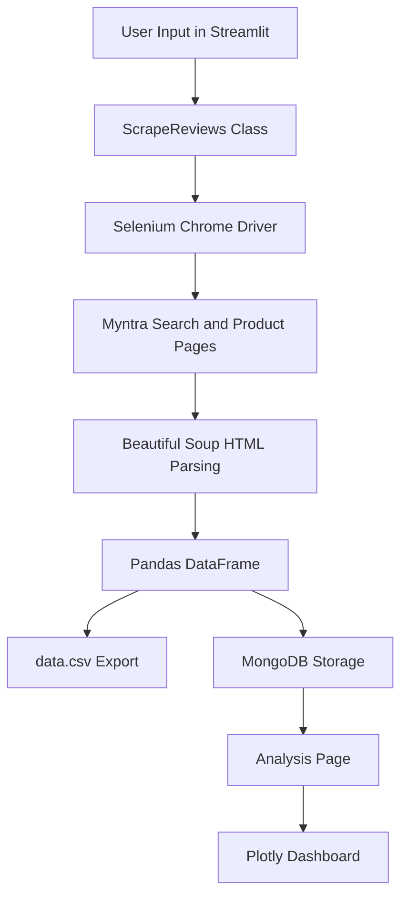

# Myntra Review Scraper & Analytics Dashboard

A Streamlit-based web scraping and analytics project that extracts product review data from Myntra, stores the scraped records in MongoDB, exports the data as CSV, and generates interactive product-level insights using Plotly charts.

This project is built as a practical Python data engineering and analytics prototype using Selenium, Beautiful Soup, Pandas, MongoDB, Streamlit, and Plotly.

---

## Features

* Search Myntra products by keyword
* Scrape product review data using Selenium and Beautiful Soup
* Extract product-level and review-level information
* Store scraped reviews in MongoDB collections
* Export scraped records into `data.csv`
* Display scraped reviews in a Streamlit UI
* Generate interactive analysis dashboards
* Compare products by average rating and average price
* Show positive and negative review sections based on user ratings

---

## Tech Stack

| Category                   | Tools / Libraries                    |
| -------------------------- | ------------------------------------ |
| Language                   | Python                               |
| Web UI                     | Streamlit                            |
| Web Scraping               | Selenium, Beautiful Soup             |
| Data Processing            | Pandas, NumPy                        |
| Database                   | MongoDB, PyMongo                     |
| Visualization              | Plotly Express, Plotly Graph Objects |
| Notebook / Experimentation | Jupyter Notebook                     |
| Environment Management     | python-dotenv, virtualenv            |

---

## Project Workflow

```text
User enters product name and product count
              |
              v
Streamlit search page receives input
              |
              v
Selenium opens Myntra product search page
              |
              v
Beautiful Soup parses product and review pages
              |
              v
Scraped reviews are converted into a Pandas DataFrame
              |
              v
Data is saved into data.csv and MongoDB
              |
              v
Streamlit analysis page displays charts and insights
```

---

## Architecture



---

## Data Fields Scraped

The scraper collects the following fields:

| Column          | Description               |
| --------------- | ------------------------- |
| Product Name    | Product title from Myntra |
| Over_All_Rating | Overall product rating    |
| Price           | Product price             |
| Date            | Review date               |
| Rating          | Individual user rating    |
| Name            | Reviewer name             |
| Comment         | Review text/comment       |

Sample output is stored in:

```text
/data.csv
```

---

## Folder Structure

```text
myntra_review_project-main/
│
├── app.py
├── data.csv
├── myntra.ipynb
├── requirements.txt
├── setup.py
├── README.md
│
├── pages/
│   └── generate_analysis.py
│
├── src/
│   ├── __init__.py
│   │
│   ├── cloud_io/
│   │   └── __init__.py
│   │
│   ├── constants/
│   │   └── __init__.py
│   │
│   ├── data_report/
│   │   ├── __init__.py
│   │   └── generate_data_report.py
│   │
│   ├── database_connect/
│   │   ├── __init__.py
│   │   └── mongo_operation.py
│   │
│   ├── scrapper/
│   │   ├── __init__.py
│   │   └── scrape.py
│   │
│   ├── utils/
│   │   └── __init__.py
│   │
│   └── exception.py
│
├── static/
│   └── css/
│       ├── main.css
│       └── style.css
│
└── templates/
    ├── base.html
    ├── index.html
    └── results.html
```

---

## Installation and Setup

### 1. Clone the Repository

```bash
git clone https://github.com/your-username/myntra_review_project.git
cd myntra_review_project
```

### 2. Create a Virtual Environment

For Windows:

```bash
python -m venv venv
venv\Scripts\activate
```

For Linux/macOS:

```bash
python3 -m venv venv
source venv/bin/activate
```

### 3. Install Dependencies

```bash
pip install -r requirements.txt
```

Recommended dependencies:

```text
streamlit
selenium
beautifulsoup4
requests
pandas
numpy
pymongo
plotly
python-dotenv
flask
flask-cors
gunicorn
ipykernel
```

---

## Environment Variables

Create a `.env` file in the root directory:

```env
MONGO_DB_URL=mongodb+srv://<username>:<password>@<cluster-url>/?retryWrites=true&w=majority
```

Do not commit real database credentials to GitHub. Keep sensitive values inside `.env` only.

---

## How to Run the Project

Start the Streamlit application:

```bash
streamlit run app.py
```

Then open the local Streamlit URL in your browser:

```text
http://localhost:8501
```

---

## How to Use

1. Enter a Myntra product keyword, for example:

```text
t shirt
```

2. Enter the number of products to scrape.

3. Click on `Scrape Reviews`.

4. The application will:

   * open Myntra using Selenium
   * collect product and review details
   * display the scraped data in Streamlit
   * save the data into MongoDB
   * export the data into `data.csv`

5. Go to the analysis page from the Streamlit sidebar.

6. Click on `Generate Analysis` to view product insights.

---

## Analytics Dashboard

The analysis dashboard provides:

* Average rating by product
* Average price comparison between products
* Product-wise review sections
* Positive review highlights
* Negative review highlights
* Rating count distribution

Visualizations are generated using Plotly.

---

## Sample Dataset

The project includes a sample `data.csv` file containing scraped Myntra review records.

Current sample data contains columns such as:

```text
Product Name, Over_All_Rating, Price, Date, Rating, Name, Comment
```

This allows the dashboard and data pipeline to be tested even after scraping has already produced data.

---

## Important Notes

* Myntra is a dynamic website, so HTML class names may change over time.
* If Myntra updates its page structure, scraper selectors may need to be updated.
* Selenium requires Google Chrome to be installed on the system.
* ChromeDriver compatibility depends on the installed Chrome browser version.
* Scraping speed depends on internet connection, page loading time, and the number of products selected.
* Use this project responsibly and avoid sending too many automated requests.

---

## Known Limitations

* The scraper depends on Myntra's current HTML structure.
* Some review fields may return default values if the page structure changes.
* MongoDB credentials should be managed through environment variables.
* The project is currently a prototype and can be improved for production use.
* Static CSS and template files are present but the main user interface is Streamlit-based.

---

## Future Improvements

* Move all secrets and database URLs fully into `.env`
* Add better exception handling for failed pages
* Add loading indicators in Streamlit
* Add product image scraping
* Add sentiment analysis for reviews
* Add search history and downloadable reports
* Add pagination support for larger review datasets
* Add automated selector validation
* Add Docker support
* Deploy the dashboard on Streamlit Cloud or Render
* Add unit tests for scraper and MongoDB operations

---

## Responsible Scraping Disclaimer

This project is created for educational and portfolio purposes only. It demonstrates web scraping, data extraction, data storage, and dashboard generation using Python. Users should respect website terms of service, avoid aggressive scraping, and use the tool responsibly.

---

## Author

**Anand Bhagat**

* B.Tech CSE, AI & ML
* Python Developer
* Backend and Data Analytics Enthusiast

---

## Project Summary

Myntra Review Scraper is a Python-based review extraction and analytics project that combines web scraping, data storage, CSV export, and interactive visualization. It demonstrates practical skills in Selenium automation, Beautiful Soup parsing, Pandas data processing, MongoDB integration, and Streamlit dashboard development.
